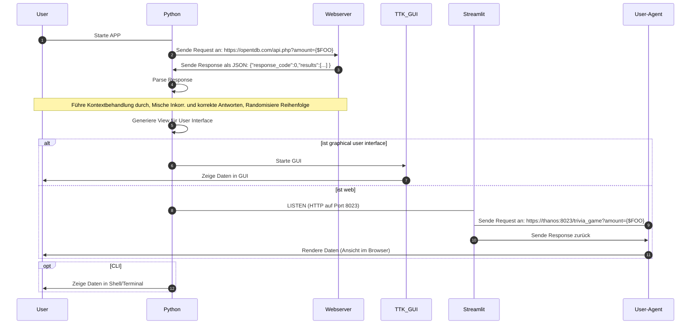

# Design & Architecture Dossier

In diesem Dokument wird die technische Umsetzung des Projektes beschrieben

Der Python-spezifische Teil findet sich hier: [PyDesgin](pydesign.md)

## Persistenzschicht

- RDBMS (SQLITE, oder ???)
- Filesystem als JSON
- Filesystem als XML ???
- Filesystem als ```__pycache__``` ???


## Zur Dokumentation Allgemein

### Tools

Markdown (insbes. Mermaid) wegen der hervorragenden Unterstützung durch github

### User Interfaces

#### Shell / Terminal / Plaintext

#### GUI

#### Web

#### Sequenzdiagramm: Abruf der Fragen



 

