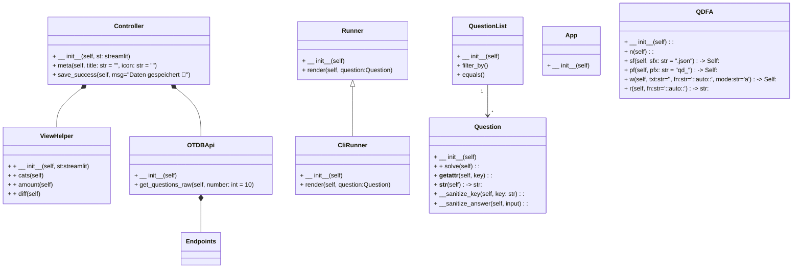

# Python 

## Package

Das <var>Main Package</var> heißt ```pyquiz```

### pyquiz.app

Sub-Package für die Steuerung der Apps (Shell, GUI, Web)


### pyquiz.api

Sub-Package für den Zugriff auf die HTTP RESTful API von Open Trivia DB


### pyquiz.mock

Sub-Package für den Zugriff auf Daten aus dem lokalen Cache (in der APP und für Tests)


### pyquiz.persist

Sub-Package für den Zugriff auf persistierte Daten allgemein


### pyquiz.entity

Sub-Package für die Repräsentation der Daten als Entity-Instanzen


## UML - Klassendiagramme [^1]


## Datenstrukturen

Die generelle Datenstruktur welche hier Verwendung findet ist [```pandas.DataFrame```](https://pandas.pydata.org/docs/reference/api/pandas.DataFrame.html)

Aus den JSON-Ressourcen (andere: tbd.) von Open Trivia DB werden ```DataFrames``` erzeugt.

### Motivation

- Robuste und performante Operationen auf (Pandas)- Datenstrukturen gewährleisten


--- 
[^1]: Dunder- Methoden enthalten hier <var>Space</var> im Namen nach "__", damit der Text nicht als __Fett__ markiert wird : 